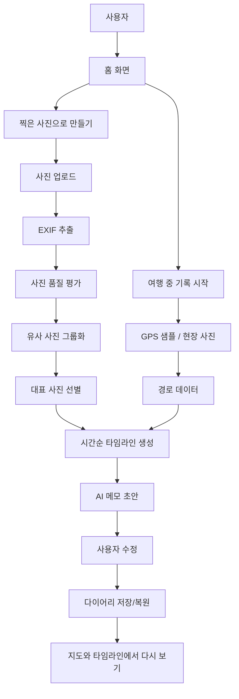

# TravelDiary 최종 문서/PPT 종합 자료본

작성 기준: 2026-07-16 현재 구현본  
용도: 발표 PPT, 프로젝트 보고서, README 업데이트, 데모 대본 제작용  
원칙: 현재 구현된 사실만 말하고, 아직 미연결된 기능은 다음 단계로 명확히 분리한다.

---

## 0. 바로 가져다 쓸 최종 요약

### 프로젝트 한 줄 소개

TravelDiary는 여행 중 남긴 위치 흐름과 사진을 연결해, 하루의 이동 경로와 대표 장면을 시간순 다이어리로 자동 정리해 주는 여행 기록 웹 앱이다.

### 발표용 핵심 문장

여행이 끝나면 사진은 많이 남지만, 어디서 무엇을 했는지 정리하는 일은 미뤄진다. TravelDiary는 사진의 촬영 시간과 위치, 이동 경로를 묶어 사용자가 바로 고쳐 쓸 수 있는 다이어리 초안을 만든다.

### 서비스 가치

- 사진첩처럼 사진만 나열하지 않고, 하루의 이동 흐름을 함께 보여준다.
- 중복 사진을 줄이고 대표 사진을 자동으로 골라준다.
- AI 메모 초안을 제공하되, 사용자가 직접 수정할 수 있게 한다.
- 실시간 기록과 여행 후 사진 업로드 흐름을 모두 지원한다.

### 현재 구현 상태 한 문장

현재 MVP는 여행 생성, 지도 기반 기록, 사진 업로드, EXIF 추출, 사진 품질 평가, 유사 사진 묶기, 대표 사진 선별, 시간순 다이어리 생성, AI 메모 초안 수정 UI까지 구현되어 있다.

### 조심해서 말해야 할 부분

- 실제 외부 AI SDK 호출은 아직 연결 전이다.
- 실시간 GPS 샘플을 백엔드 위치 API로 자동 전송하는 연결은 아직 남아 있다.
- 지도와 장소명 품질은 Mapbox 토큰과 외부 API 응답에 영향을 받는다.

---

## 1. 프로젝트 개요

### 프로젝트명

TravelDiary

### 문제 정의

여행을 다녀오면 사진은 많이 남지만, 그 사진을 시간순으로 정리하고 장소별 기억을 적는 일은 번거롭다. 특히 비슷한 사진이 많거나 이동 경로가 길면, 사용자는 어떤 사진을 대표로 골라야 하는지, 어느 장소에서 찍은 사진인지 다시 확인해야 한다.

TravelDiary는 이 문제를 다음 방식으로 해결한다.

1. 사진의 촬영 시간과 GPS 정보를 읽는다.
2. 이동 경로와 사진 위치를 연결한다.
3. 중복 사진을 묶고 품질이 좋은 대표 사진을 고른다.
4. 장소별 메모 초안을 생성한다.
5. 사용자가 초안을 직접 수정해 최종 다이어리로 남긴다.

### 목표 사용자

- 여행 중 이동 경로와 사진을 같이 기록하고 싶은 사용자
- 여행 후 사진 정리를 미루는 사용자
- 위치와 시간 기반으로 하루를 다시 보고 싶은 사용자
- 사진첩보다 이야기 흐름이 있는 여행 기록을 원하는 사용자

### 핵심 사용자 상황

| 상황 | 기존 불편 | TravelDiary 해결 |
|---|---|---|
| 여행 중 | 이동 경로와 사진이 따로 남음 | GPS 기록과 현장 사진을 같은 지도에 표시 |
| 여행 후 | 사진이 많아 정리하기 어려움 | EXIF 기반으로 시간순 정리 |
| 중복 사진 | 비슷한 사진을 직접 골라야 함 | 유사 사진 그룹화 후 대표 사진 선별 |
| 기록 작성 | 기억을 떠올려 문장을 써야 함 | AI 메모 초안 제공 후 사용자가 수정 |
| 다시 보기 | 사진첩만으로는 하루 흐름이 안 보임 | 지도, 경로, 시간순 다이어리 제공 |

---

## 2. 최종 기능 목록

### 2.1 홈/표지 UI

최근 개선된 표지 화면은 사용자가 시작 방식을 헷갈리지 않도록 설계했다.

구성:

- 상단 왼쪽: `Travel Diary` 브랜드 배지
- 상단 오른쪽: `지난 다이어리` 바로가기
- 제목: `지금 여행 중인가요?`
- 입력: 여행 제목, 날짜, 지역
- 시작 방식 2가지:
  - `여행 중 기록 시작`
  - `찍은 사진으로 만들기`

UX 개선 포인트:

- `지난 다이어리`를 새 여행 시작 버튼과 분리했다.
- 시작 버튼을 작은 텍스트 버튼이 아니라 큰 선택 카드로 바꿨다.
- 각 버튼에 설명을 넣어 눌렀을 때 무슨 일이 일어나는지 예측 가능하게 했다.
- 두 선택지를 색과 아이콘으로 구분했다.
- 첫 화면에서 두 선택지가 모두 보이도록 간격과 크기를 조정했다.

### 2.2 여행 생성

사용자는 여행 제목, 날짜, 지역을 입력한다.

구현 내용:

- 제목이 비어 있으면 기본값 `새 여행` 사용
- 지역이 비어 있으면 기본값 `미정 지역` 사용
- 입력값은 localStorage에 임시 저장
- 서버에는 `POST /api/trips`로 여행 생성 요청
- 서버 생성에 실패해도 로컬 화면 흐름은 계속 사용 가능

### 2.3 실시간 기록 모드

`여행 중 기록 시작`을 누르면 지도 화면으로 이동하고 GPS 기록이 시작된다.

구현 내용:

- 브라우저 Geolocation API 사용
- 현재 위치 마커 표시
- 이동 경로를 지도 선으로 표시
- 일정 시간/거리 기준으로 발자국 마커 표시
- 기록 시간 타이머 표시
- 기록 중 현장 사진 추가 가능
- 위치 권한 실패 시 안내 토스트 표시

현재 한계:

- 프런트에서 수집한 실시간 GPS 샘플은 현재 로컬 상태/localStorage에 저장된다.
- 백엔드의 위치 저장 API는 준비되어 있지만, 프런트 자동 전송 연결은 다음 단계다.

### 2.4 사진으로 만들기 모드

`찍은 사진으로 만들기`를 누르면 사용자는 이미 찍은 사진을 선택하고 다이어리를 만들 수 있다.

구현 내용:

- JPEG/PNG 사진 다중 선택
- 서버 업로드
- 업로드 진행률 표시
- EXIF 촬영 시간/GPS 추출
- 사진 품질 평가
- 유사 사진 그룹화
- 대표 사진 선별
- 시간순 다이어리 생성

fallback:

- 백엔드 생성이 실패하면 프런트에서 사진 EXIF와 로컬 GPS 샘플로 다이어리를 생성한다.

### 2.5 지도 보기

지도는 여행 경로와 장소별 기록을 시각화한다.

구현 내용:

- Mapbox GL JS 지도 사용
- GPS 샘플 기반 경로선 표시
- 발자국 마커 표시
- 현장 사진 마커 표시
- 사진 위치 기반 경로 복원
- 다이어리 엔트리 위치 기반 경로 복원
- 다이어리 카드의 `지도에서 보기` 클릭 시 해당 위치로 이동

지도 표시 우선순위:

1. 실시간 GPS 샘플
2. 저장된 사진 좌표
3. 다이어리 엔트리 위치

### 2.6 다이어리 화면

다이어리 화면은 하루를 시간순 카드로 보여준다.

카드 구성:

- 날짜/시간
- 장소명
- 사진 수
- 기록 시간
- 대표 사진
- AI 메모 초안
- 지도에서 보기 버튼
- 사진 좋아요/별로예요 버튼
- 메모 수정 버튼

### 2.7 AI 메모 초안 및 수정

현재 구현은 외부 AI 호출 대신 AI 훅과 fallback 메모 생성 로직을 갖춘 상태다.

설계 기준:

- 감정 과장 금지
- 사진에 없는 사실 생성 금지
- 뻔한 감성 문구 회피
- 시간대, 장소, 동선 흐름 중심
- 사용자가 고쳐 쓰기 쉬운 관찰형 문장

사용자 수정:

- 카드 안에서 `수정` 클릭
- textarea로 메모 수정
- `저장` 또는 `취소`
- 빈 메모 저장 방지
- 300자 제한
- 서버 다이어리가 있는 경우 PATCH API로 저장
- 서버 저장 실패 시 로컬 기록에 저장

---

## 3. 전체 시스템 구조

### 구조 요약

```text
사용자
  -> 프런트엔드(index.html, styles.css, app.js)
  -> FastAPI 백엔드
  -> SQLite 저장소
  -> 사진 처리 파이프라인
  -> 다이어리 JSON
  -> 지도/타임라인 UI
```

### Mermaid 구조도



### 사용 기술

| 영역 | 기술 |
|---|---|
| 프런트엔드 | HTML, CSS, Vanilla JavaScript |
| 지도 | Mapbox GL JS |
| 위치 기록 | Web Geolocation API |
| 백엔드 | FastAPI |
| 저장소 | SQLite |
| 이미지 처리 | Pillow, NumPy |
| 테스트 | pytest, FastAPI TestClient |
| 배포/빌드 준비 | npm script, service worker, Railway/Vercel 설정 파일 |

---

## 4. 백엔드 API 정리

| 메서드 | 경로 | 설명 |
|---|---|---|
| POST | `/api/trips` | 여행 생성 |
| POST | `/api/trips/{trip_id}/locations` | GPS 좌표 저장 |
| POST | `/api/trips/{trip_id}/photos` | 사진 업로드 |
| GET | `/api/trips/{trip_id}/photos` | 사진 목록 조회 |
| POST | `/api/trips/{trip_id}/generate` | 다이어리 생성 |
| POST | `/api/trips/{trip_id}/photo-feedback` | 사진 선호 피드백 저장 |
| GET | `/api/trips/{trip_id}/diary` | 다이어리 조회 |
| PATCH | `/api/trips/{trip_id}/diary/notes/{entry_index}` | 다이어리 메모 수정 |
| GET | `/api/trips/latest` | 마지막 여행 조회 |

### 데이터 저장

SQLite DB:

```text
data/travel_diary.sqlite3
```

테이블:

| 테이블 | 저장 내용 |
|---|---|
| `trips` | 여행 메타데이터, 다이어리 JSON, 사진 피드백 JSON |
| `locations` | GPS 좌표 |
| `photos` | 사진 메타데이터 JSON |

---

## 5. 핵심 로직 정리

### 5.1 사진 처리 파이프라인

```text
사진 업로드
  -> EXIF 촬영시간/GPS 추출
  -> 사진 품질 평가
  -> 유사 사진 그룹화
  -> 그룹별 대표 후보 선정
  -> 최대 3장 대표 사진 선택
```

### 5.2 사진 품질 평가 기준

| 항목 | 설명 |
|---|---|
| 선명도 | Laplacian variance로 흔들림/초점 확인 |
| 해상도 | 메가픽셀과 짧은 변 길이 평가 |
| 노출 | 평균 밝기와 암부/하이라이트 비율 평가 |
| 구도 | 중앙부 안정성 평가 |
| 화면 균형 | 좌우/상하 밝기 균형 평가 |
| 채도 | 과하게 낮거나 높은 채도 감점 |
| 중앙 피사체 힌트 | 중앙부 디테일이 배경보다 강한지 추정 |
| 역광 | 배경이 밝고 중앙 피사체가 어두우면 감점 |

대표 사진 선택 기준:

- 유사 사진 그룹마다 가장 품질이 좋은 사진을 후보로 남긴다.
- rejected 사진은 우선 제외한다.
- 후보를 품질, 구도, 중앙 피사체, 해상도 기준으로 정렬한다.
- 최대 3장을 대표 사진으로 선택한다.

### 5.3 유사 사진 그룹화

방식:

- 이미지를 흑백 8x8로 축소
- 평균 밝기 기준으로 average hash 생성
- Hamming distance가 10 이하이면 유사 사진으로 판단

목적:

- 비슷한 연속 촬영 사진을 모두 보여주지 않기
- 대표 사진 후보를 줄이기
- 사용자가 직접 사진을 고르는 부담 줄이기

### 5.4 경로 생성

우선순위:

1. 사진 EXIF GPS와 촬영 시간이 2장 이상 있으면 사진 기반 경로 생성
2. 사진 기반 경로가 불가능하면 서버에 저장된 GPS 좌표 사용
3. 프런트 지도에서는 로컬 GPS, 사진 좌표, 다이어리 위치 순으로 복원

정차 지점 기준:

- 같은 장소 반경: 30m
- 3분 이상 같은 장소에 머물면 정차 지점으로 기록

GPS 정리 기준:

- 정확도 100m 초과 좌표 제외
- 약 300km/h 이상 이동으로 계산되면 순간이동으로 보고 제외
- 2m 미만 이동은 중복으로 보고 제외

### 5.5 타임라인 생성

방식:

- 대표 사진을 촬영 시간순으로 정렬
- 사진 위치가 정차 지점 200m 이내이면 해당 지점과 연결
- 연결할 지점이 없으면 `이동 중`으로 표시
- 각 엔트리에 시간, 장소, 사진 URL, 좌표, 메모를 넣는다

### 5.6 AI 메모 초안 로직

현재 구조:

- `AI_API_KEY`를 확인하는 훅은 있음
- 실제 외부 AI SDK 호출은 아직 미연결
- 현재는 fallback 문장 생성으로 안정적인 데모 가능

메모 생성 원칙:

```text
장소 + 시간대 + 이동 흐름
과장된 감정 표현 금지
사진에 없는 사실 생성 금지
사용자가 고치기 쉬운 초안 문장
```

예시:

```text
오후 성수동 카페거리에서 남긴 기록. 이 위치가 오늘 동선의 한 지점으로 선명하게 잡혔어요.
성수동 카페거리에 머문 흔적을 오후 기록으로 묶었어요. 사진과 위치가 같은 흐름 안에 있어요.
오후의 성수동 카페거리 기록. 이동 중 지나친 곳이 아니라 잠시 멈춘 지점으로 정리했어요.
```

발표 표현:

> AI가 최종 문장을 대신 써 주는 것이 아니라, 사용자가 기억을 꺼낼 수 있도록 첫 문장 초안을 제공한다.

---

## 6. UI/UX 개선 내용

### 최근 개선된 홈 UI

기존 문제:

- `실시간 기록 시작`과 `사진으로 만들기`가 일반 버튼처럼 보여 차이가 덜 명확했다.
- `다이어리 바로가기`가 새 여행 시작 흐름과 섞여 보였다.
- 사용자가 처음 들어왔을 때 무엇을 눌러야 하는지 설명이 약했다.

개선:

- 첫 질문을 `지금 여행 중인가요?`로 변경
- 지난 다이어리 버튼을 상단 보조 액션으로 이동
- 시작 방식을 큰 선택 카드로 변경
- 각 선택에 설명 추가
- 터치 영역 확대
- 색과 아이콘으로 두 흐름 구분
- 한 화면 안에 두 선택지가 모두 보이도록 간격 조정

### 사용자 친화 포인트

| 개선 요소 | 사용자 효과 |
|---|---|
| 상황형 질문 | 사용자가 자기 상황에 맞게 바로 선택 |
| 큰 선택 카드 | 클릭 가능한 영역이 명확함 |
| 설명 문구 | 누른 뒤 일어날 일을 예측 가능 |
| 지난 다이어리 분리 | 새 여행 생성과 기존 기록 확인이 헷갈리지 않음 |
| 캐시 버전 갱신 | 업데이트된 UI가 바로 반영됨 |

---

## 7. 발표 PPT 구성안

### 1장. 표지

제목:

```text
TravelDiary
위치와 사진으로 완성하는 여행 다이어리
```

부제:

```text
여행 중 남긴 경로와 사진을 시간순 기록으로 자동 정리하는 웹 앱
```

### 2장. 문제 정의

핵심 문장:

```text
여행 사진은 많이 남지만, 여행의 흐름은 사진첩만으로 잘 보이지 않는다.
```

넣을 내용:

- 여행 후 사진 정리는 미뤄짐
- 중복 사진이 많음
- 어디서 찍은 사진인지 다시 찾아야 함
- 메모 작성은 사용자가 직접 해야 함

### 3장. 해결 아이디어

핵심 문장:

```text
사진의 시간과 위치, 이동 경로를 연결해 하루의 흐름을 다이어리로 만든다.
```

흐름:

```text
GPS 기록 + 사진 업로드
-> 사진 분석
-> 대표 사진 선별
-> 시간순 다이어리
-> 사용자 수정
```

### 4장. 사용자 흐름

두 가지 시작 방식:

- 여행 중 기록 시작
- 찍은 사진으로 만들기

설명:

```text
여행 중에는 경로와 현장 사진을 기록하고,
여행 후에는 이미 찍은 사진만으로 다이어리를 만들 수 있다.
```

### 5장. 주요 기능

표로 구성:

| 기능 | 설명 |
|---|---|
| GPS 기록 | 실시간 위치와 경로 기록 |
| 사진 업로드 | 여행 사진 다중 선택 |
| EXIF 추출 | 촬영 시간과 GPS 추출 |
| 사진 선별 | 품질/유사도 기반 대표 사진 선택 |
| 지도 보기 | 경로와 장소별 기록 확인 |
| AI 메모 초안 | 장소/시간 기반 문장 생성 |
| 메모 수정 | 사용자가 직접 수정 후 저장 |

### 6장. 시스템 구조

넣을 도식:

```text
Frontend
  -> FastAPI
  -> SQLite
  -> Photo Pipeline
  -> Diary Timeline
```

설명:

```text
프런트는 지도와 사용자 흐름을 담당하고,
백엔드는 사진 분석, 경로 계산, 다이어리 생성을 담당한다.
```

### 7장. 사진 분석 로직

핵심:

- EXIF 촬영 시간/GPS
- 선명도
- 해상도
- 노출
- 구도
- 유사 사진 그룹화
- 대표 사진 최대 3장

발표 문장:

```text
단순히 첫 사진을 고르는 것이 아니라, 품질 점수와 유사 사진 그룹을 함께 고려해 대표 사진을 선택한다.
```

### 8장. 경로/타임라인 로직

핵심:

- 사진 GPS 우선
- GPS 샘플 fallback
- 시간순 정렬
- 정차 지점 매칭
- 지도에서 보기

발표 문장:

```text
사진이 언제 어디서 찍혔는지 기준으로 하루의 이동 순서를 복원한다.
```

### 9장. AI 메모 초안

핵심:

- 과장된 감성 문구 회피
- 장소/시간/동선 기반
- 사용자가 수정 가능

발표 문장:

```text
AI 메모는 완성된 글이 아니라, 사용자가 자기 기억을 더 쉽게 떠올리도록 돕는 초안이다.
```

### 10장. 데모

추천 데모 순서:

1. 홈 화면에서 두 시작 방식 설명
2. 사진으로 만들기 클릭
3. 사진 선택
4. 다이어리 카드 생성 확인
5. 지도에서 보기 클릭
6. AI 메모 수정 후 저장
7. 사진 좋아요/별로예요 피드백 설명

### 11장. 구현 결과

넣을 내용:

- 프런트 화면 구현
- FastAPI API 구현
- SQLite 저장 구현
- 사진 처리 파이프라인 구현
- 다이어리 메모 수정 구현
- 자동 테스트 통과

검증 문장:

```text
현재 백엔드 파이프라인 테스트와 프런트 빌드 확인을 통과한 상태다.
```

### 12장. 한계와 다음 단계

한계:

- 외부 AI SDK 호출 미연결
- 실시간 GPS 서버 동기화 미완성
- 장소명 품질은 지도 API에 의존

다음 단계:

- AI API 연결
- GPS 서버 저장 연결
- 데모용 샘플 데이터 구성
- 장소명/메모 품질 고도화
- 배포 환경 안정화

---

## 8. 보고서 구성안

### 1. 서론

포함 내용:

- 프로젝트 배경
- 문제 정의
- 목표 사용자
- 핵심 기능 요약

샘플 문장:

```text
본 프로젝트는 여행 후 사진 정리와 기록 작성의 번거로움을 줄이기 위해 시작되었다. 사용자는 여행 중 많은 사진을 남기지만, 이후 시간순으로 정리하거나 장소별 메모를 작성하는 과정은 반복적이고 부담스럽다. TravelDiary는 사진의 촬영 시간과 위치, 이동 경로를 활용해 여행 기록의 초안을 자동으로 생성하는 것을 목표로 한다.
```

### 2. 서비스 기획

포함 내용:

- 사용자 문제
- 기존 방식의 한계
- TravelDiary의 해결 방식
- 사용자 흐름

### 3. 시스템 설계

포함 내용:

- 프런트/백엔드 구조
- 데이터 저장 구조
- API 목록
- 전체 파이프라인

### 4. 주요 구현

포함 내용:

- 홈 UI 개선
- 지도 기반 기록
- 사진 업로드와 EXIF 추출
- 품질 평가와 대표 사진 선택
- 시간순 다이어리
- AI 메모 초안과 수정

### 5. 테스트 및 검증

포함 내용:

- 단위 테스트
- 파이프라인 테스트
- 프런트 빌드 확인
- 브라우저 렌더링 확인

### 6. 한계 및 개선 방향

포함 내용:

- 외부 AI 호출 연결
- GPS 서버 동기화
- 장소명 고도화
- 대량 사진 처리
- 개인정보 보호 강화

---

## 9. 발표 대본 초안

### 도입

```text
저희 서비스는 TravelDiary입니다. 여행을 다녀오면 사진은 많이 남지만, 그 사진을 시간순으로 정리하고 장소별로 기억을 적는 일은 생각보다 번거롭습니다. TravelDiary는 이 문제를 해결하기 위해 사진의 촬영 시간과 위치, 그리고 여행 중 기록한 GPS 경로를 연결해서 하루의 흐름이 보이는 다이어리 초안을 만들어 주는 웹 앱입니다.
```

### 기능 설명

```text
사용자는 두 가지 방식으로 시작할 수 있습니다. 여행 중이라면 실시간 기록을 시작해서 GPS 경로와 현장 사진을 남길 수 있고, 이미 여행을 마친 상태라면 찍어 둔 사진을 업로드해서 다이어리를 만들 수 있습니다.
```

### 기술 설명

```text
백엔드에서는 사진의 EXIF 정보를 읽어 촬영 시간과 GPS를 추출하고, 선명도와 노출, 해상도, 구도 등을 기준으로 사진 품질을 평가합니다. 이후 유사한 사진을 그룹으로 묶고, 각 그룹에서 대표 사진을 골라 시간순 타임라인을 구성합니다.
```

### AI 메모 설명

```text
다이어리에는 AI 메모 초안이 들어갑니다. 여기서 중요한 점은 AI가 과장된 감성 문장을 완성해 주는 것이 아니라, 사용자가 자기 기억을 떠올리고 수정할 수 있도록 첫 문장을 제공한다는 점입니다. 그래서 문장도 장소, 시간, 동선 중심으로 담백하게 설계했습니다.
```

### 마무리

```text
현재 MVP는 여행 생성, 사진 업로드, 사진 분석, 대표 사진 선별, 시간순 다이어리 생성, 지도 보기, 메모 수정까지 구현되어 있습니다. 다음 단계에서는 실제 외부 AI API 연결과 실시간 GPS 서버 동기화를 진행해 서비스 완성도를 높일 계획입니다.
```

---

## 10. 예상 질문과 답변

### Q1. AI가 실제로 글을 써 주나요?

현재는 외부 AI SDK 호출이 연결되기 전 단계다. 대신 AI 호출을 넣을 수 있는 훅과 fallback 메모 생성 로직을 구현했다. 발표에서는 "AI 메모 초안 구조를 구현했고, 실제 외부 AI 연결은 다음 단계"라고 말하는 것이 정확하다.

### Q2. 사진이 위치 정보를 가지고 있지 않으면 어떻게 되나요?

사진 자체에 GPS가 없으면 실시간 기록된 GPS 샘플을 활용해 위치를 추정할 수 있다. 다만 현재 실시간 GPS 샘플의 서버 자동 저장은 아직 연결 전이므로, 완전한 정확도를 위해서는 다음 단계에서 GPS 서버 동기화가 필요하다.

### Q3. 대표 사진은 어떤 기준으로 고르나요?

사진 품질 점수와 유사 사진 그룹을 함께 본다. 선명도, 해상도, 노출, 구도, 채도, 중앙 피사체 힌트 등을 평가하고, 비슷한 사진 그룹에서는 가장 품질이 좋은 사진을 대표 후보로 선택한다.

### Q4. 사용자가 AI 메모를 마음대로 수정할 수 있나요?

가능하다. 각 다이어리 카드에서 `수정` 버튼을 누르면 메모를 직접 고칠 수 있고, 저장하면 로컬 기록과 서버 다이어리에 반영된다.

### Q5. 개인정보 문제는 어떻게 처리하나요?

사진과 위치 정보는 민감정보로 취급한다. API 키는 브라우저가 아니라 서버 환경변수에 두는 구조이며, AI 호출 시에도 필요한 최소 데이터만 전달하는 방향으로 설계했다.

### Q6. 현재 완성도가 어느 정도인가요?

MVP의 핵심 흐름은 구현되어 있다. 다만 실제 외부 AI 호출, 실시간 GPS 서버 동기화, 데모 데이터 정교화는 다음 개발 단계로 남아 있다.

---

## 11. 정확한 현재 상태 체크리스트

### 구현됨

- 여행 기본 정보 입력
- 실시간 기록 시작
- 사진으로 만들기
- 지도 화면
- 위치 마커
- 경로선
- 발자국
- 현장 사진 마커
- 사진 업로드
- EXIF 추출
- 사진 품질 평가
- 유사 사진 그룹화
- 대표 사진 선별
- 사진 선호 피드백
- 다이어리 생성
- 지도에서 보기
- AI 메모 초안
- 메모 수정/저장
- 일자별 기록 보기
- service worker 캐시 버전 관리
- 테스트 코드

### 부분 구현

- AI 메모: 외부 AI 호출은 미연결, fallback 로직 구현
- 실시간 GPS 서버 저장: API는 구현, 프런트 자동 전송은 미연결
- 장소명: Mapbox reverse geocoding에 의존

### 다음 단계

- AI API 연결
- GPS 샘플 서버 저장 연결
- README 최신화
- PPT용 화면 캡처 정리
- 실제 샘플 사진/경로 데이터 준비
- 배포 환경 점검

---

## 12. 복붙용 짧은 문장 모음

### 서비스 설명

```text
TravelDiary는 위치와 사진을 기반으로 여행 하루를 시간순 다이어리로 정리해 주는 웹 앱입니다.
```

### 문제 정의

```text
여행 사진은 많이 남지만, 사진만으로는 그날의 이동 흐름과 장소별 기억을 다시 보기 어렵습니다.
```

### 해결 방식

```text
사진의 촬영 시간과 GPS, 여행 중 기록한 위치 데이터를 연결해 대표 사진과 메모가 포함된 다이어리를 생성합니다.
```

### AI 메모

```text
AI 메모는 최종 글을 대신 작성하는 것이 아니라, 사용자가 쉽게 수정할 수 있는 담백한 초안으로 설계했습니다.
```

### 기술 포인트

```text
EXIF 추출, 사진 품질 평가, 유사 사진 그룹화, 대표 사진 선별, 경로 매칭을 하나의 파이프라인으로 연결했습니다.
```

### 현재 한계

```text
외부 AI API 호출과 실시간 GPS 서버 동기화는 다음 단계이며, 현재는 안정적인 MVP 흐름과 fallback 구조를 우선 구현했습니다.
```

---

## 13. 최종 발표 톤 가이드

### 이렇게 말하기

- "MVP 핵심 흐름을 구현했습니다."
- "AI 메모 초안 구조와 수정 흐름을 구현했습니다."
- "사진 분석과 대표 사진 선별 기준을 코드로 만들었습니다."
- "아직 미연결된 부분은 다음 단계로 분리했습니다."

### 이렇게 말하지 않기

- "AI가 완전히 자동으로 감성 다이어리를 써 줍니다."
- "GPS가 실시간으로 서버에 완벽히 저장됩니다."
- "장소명을 100% 정확히 인식합니다."
- "대량 사진을 완벽히 처리합니다."

---

## 14. 최종 산출물 목록

현재 문서/PPT 제작에 쓸 수 있는 자료:

- `docs/FINAL_REPORT_PPT_KIT.md`: 최종 문서/PPT 종합 자료본
- `docs/PRESENTATION_PREP_CURRENT_IMPLEMENTATION.md`: 구현 상세 자료
- `README.md`: 프로젝트 배경과 팀 개발 규칙
- `docs/TEAM_GUIDE.md`: 팀 작업 가이드
- `outputs/TravelDiary_MVP_Architecture.png`: 아키텍처 이미지
- `outputs/TravelDiary_Day2_Project_Status_Brief.docx`: 기존 상태 보고서
- `outputs/day2_doc_render/TravelDiary_Day2_Project_Status_Brief.pdf`: 기존 PDF 자료
- `prompts/curator.txt`: AI 메모 프롬프트 초안
- `backend/fixtures/sample_diary.json`: 다이어리 JSON 예시

---

## 15. 지금 PPT로 옮길 때 추천 순서

1. 표지: 서비스명과 한 줄 설명
2. 문제: 여행 사진 정리의 불편
3. 해결: 위치와 사진을 연결한 다이어리
4. 사용자 흐름: 여행 중 / 여행 후
5. 핵심 기능: 지도, 사진, 대표 사진, 메모
6. 시스템 구조: 프런트, 백엔드, DB, 파이프라인
7. 사진 분석 로직
8. 경로/타임라인 로직
9. AI 메모와 사용자 수정
10. 데모 화면
11. 구현 결과와 테스트
12. 한계와 다음 단계

